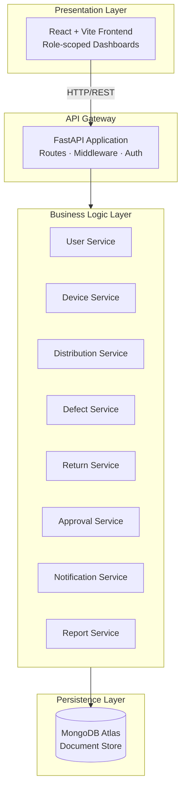
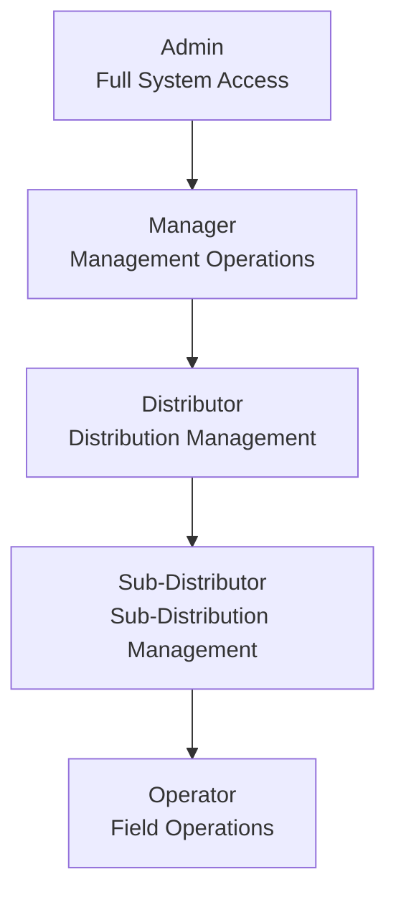
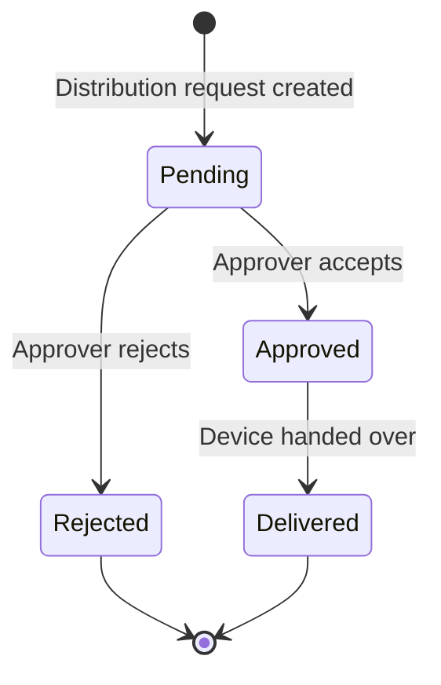
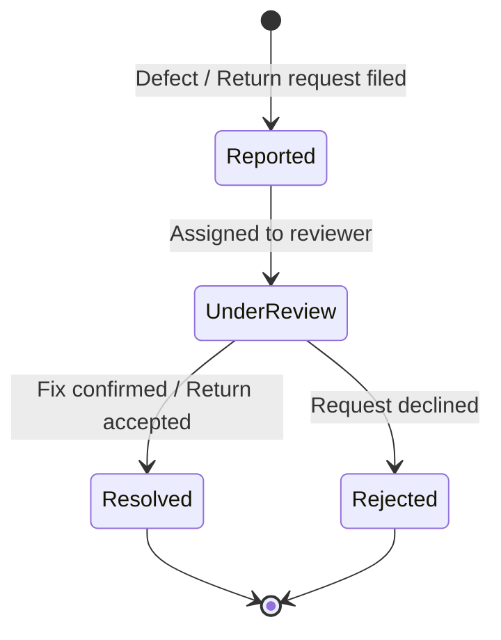
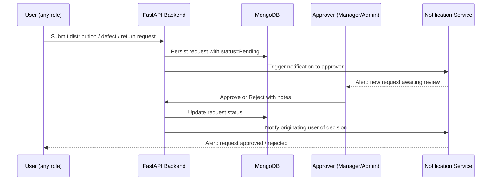
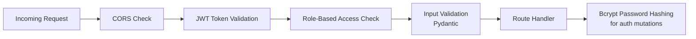

# Distribution Management System

A full-stack web application for managing device distribution across different organizational levels with role-based access control.

## Table of Contents

- [1. Core Idea](#1-core-idea)
- [2. Technology Stack](#2-technology-stack)
- [3. System Architecture](#3-system-architecture)
- [4. Project Structure](#4-project-structure)
- [5. Key Features](#5-key-features)
- [6. Role Hierarchy & Access Control](#6-role-hierarchy--access-control)
- [7. Core Workflows](#7-core-workflows)
- [8. API Overview](#8-api-overview)
- [9. Security Features](#9-security-features)
- [10. Setup Instructions](#10-setup-instructions)
- [11. Configuration](#11-configuration)
- [12. Running Both Servers](#12-running-both-servers)
- [13. Demo Accounts](#13-demo-accounts)
- [14. Testing](#14-testing)
- [15. Building for Production](#15-building-for-production)
- [16. Troubleshooting](#16-troubleshooting)
- [17. Development Notes](#17-development-notes)
- [18. Contributing](#18-contributing)
- [19. License](#19-license)

---

## 1. Core Idea

The Distribution Management System (DMS) provides end-to-end visibility and control over how devices move through an organisational hierarchy:

1. Devices are registered and given a trackable identity.
2. Distribution requests flow through a structured approval chain.
3. Defects and returns are captured, categorised, and resolved.
4. Role-scoped dashboards give every actor — from Admin to Operator — the right view of the system.

---

## 2. Technology Stack

### Backend

- **FastAPI** — Modern Python async web framework
- **MongoDB** — NoSQL document database with Motor async driver
- **JWT** — JSON Web Tokens for stateless authentication
- **Pydantic** — Data validation and serialisation
- **Bcrypt** — Secure password hashing

### Frontend

- **React** — Component-based UI library
- **Vite** — Fast build toolchain and dev server
- **Tailwind CSS** — Utility-first CSS framework
- **React Router** — Client-side routing
- **Context API** — Lightweight state management

---

## 3. System Architecture



---

## 4. Project Structure

```text
distribution-management-system/
├── backend/
│   ├── app/
│   │   ├── models/          # Pydantic models
│   │   ├── routes/          # API endpoints
│   │   ├── services/        # Business logic
│   │   ├── middleware/      # Auth & error handling
│   │   ├── utils/           # Helper functions
│   │   ├── schemas/         # Response schemas
│   │   ├── main.py          # FastAPI app entry point
│   │   ├── config.py        # Settings
│   │   └── database.py      # MongoDB connection
│   ├── requirements.txt
│   ├── .env
│   └── README.md
│
├── frontend/
│   ├── src/
│   │   ├── components/      # Reusable UI components
│   │   ├── pages/           # Page-level components
│   │   ├── context/         # Context providers
│   │   ├── services/        # API service layer
│   │   ├── App.jsx
│   │   └── main.jsx
│   ├── public/
│   │   └── favicon.svg
│   ├── index.html
│   ├── package.json
│   ├── vite.config.js
│   └── tailwind.config.js
│
└── README.md
```

---

## 5. Key Features

### User Management
- Create, read, update, delete users
- Role-based access control (Admin, Manager, Distributor, Sub-Distributor, Operator)
- User status management (Active, Inactive, Suspended)
- Profile management

### Device Management
- Register new devices with serial number tracking
- Track device status, location, and current holder
- Full device history and audit trail

### Distribution System
- Create and manage distribution requests
- Structured approval workflow
- Status tracking: Pending → Approved → Delivered / Rejected

### Defect Reporting
- Report and categorise device defects by type and severity
- Resolution workflow with history tracking

### Return Management
- Create and approve return requests
- Reason categorisation and status tracking

### Approval System
- Centralised approval dashboard for distributions, returns, and defects
- Approval notes and full history

### Notifications
- Real-time notification centre
- Unread count badge and mark-as-read functionality

### Reports & Analytics
- Inventory, distribution, defect, return, user activity, and device utilisation reports

### Dashboard
- Role-specific views with live statistics, activity feeds, charts, and system alerts

---

## 6. Role Hierarchy & Access Control



| Role | Email | Access Scope |
|---|---|---|
| Admin | admin@dms.com | Full system access |
| Manager | manager@dms.com | Management operations |
| Distributor | distributor@dms.com | Distribution management |
| Sub-Distributor | subdist@dms.com | Sub-distribution management |
| Operator | operator@dms.com | Field operations |

---

## 7. Core Workflows

### Distribution Lifecycle



### Defect & Return Resolution



### Request Approval Flow



---

## 8. API Overview

All endpoints are mounted under `/api`.

### Authentication
- `POST /api/auth/login` — User login
- `POST /api/auth/logout` — User logout
- `GET /api/auth/me` — Get current user
- `PUT /api/auth/password` — Change password

### Users
- `GET /api/users` — List users (paginated)
- `GET /api/users/{id}` — Get user by ID
- `POST /api/users` — Create user
- `PUT /api/users/{id}` — Update user
- `DELETE /api/users/{id}` — Delete user
- `PATCH /api/users/{id}/status` — Update user status

### Devices
- `GET /api/devices` — List devices (paginated)
- `GET /api/devices/{id}` — Get device by ID
- `GET /api/devices/available` — Get available devices
- `GET /api/devices/track/{serial}` — Track by serial number
- `GET /api/devices/{id}/history` — Get device history
- `POST /api/devices` — Register device
- `PUT /api/devices/{id}` — Update device
- `DELETE /api/devices/{id}` — Delete device
- `PATCH /api/devices/{id}/status` — Update device status

### Distributions
- `GET /api/distributions` — List distributions
- `GET /api/distributions/{id}` — Get distribution by ID
- `GET /api/distributions/pending` — Get pending distributions
- `POST /api/distributions` — Create distribution
- `PATCH /api/distributions/{id}/status` — Update status
- `DELETE /api/distributions/{id}` — Cancel distribution

### Defects
- `GET /api/defects` — List defect reports
- `GET /api/defects/{id}` — Get defect by ID
- `POST /api/defects` — Create defect report
- `PUT /api/defects/{id}` — Update defect
- `PATCH /api/defects/{id}/status` — Update status
- `PATCH /api/defects/{id}/resolve` — Resolve defect
- `DELETE /api/defects/{id}` — Delete defect

### Returns
- `GET /api/returns` — List return requests
- `GET /api/returns/{id}` — Get return by ID
- `POST /api/returns` — Create return request
- `PATCH /api/returns/{id}/status` — Update status
- `DELETE /api/returns/{id}` — Cancel return

### Approvals
- `GET /api/approvals` — List pending approvals
- `GET /api/approvals/{id}` — Get approval by ID
- `POST /api/approvals/{id}/approve` — Approve request
- `POST /api/approvals/{id}/reject` — Reject request

### Operators
- `GET /api/operators` — List operators
- `GET /api/operators/{id}` — Get operator by ID
- `GET /api/operators/{id}/devices` — Get operator devices
- `POST /api/operators` — Create operator
- `PUT /api/operators/{id}` — Update operator
- `DELETE /api/operators/{id}` — Delete operator

### Notifications
- `GET /api/notifications` — List notifications
- `GET /api/notifications/unread` — Get unread count
- `PATCH /api/notifications/{id}/read` — Mark as read
- `PATCH /api/notifications/read-all` — Mark all as read
- `DELETE /api/notifications/{id}` — Delete notification

### Reports
- `GET /api/reports/inventory` — Inventory report
- `GET /api/reports/distribution-summary` — Distribution summary
- `GET /api/reports/defect-summary` — Defect summary
- `GET /api/reports/return-summary` — Return summary
- `GET /api/reports/user-activity` — User activity report
- `GET /api/reports/device-utilization` — Device utilisation report

### Dashboard
- `GET /api/dashboard/stats` — Dashboard statistics
- `GET /api/dashboard/recent-activities` — Recent activities
- `GET /api/dashboard/charts/distributions` — Distribution chart data
- `GET /api/dashboard/charts/defects` — Defect chart data
- `GET /api/dashboard/alerts` — System alerts

---

## 9. Security Features



- JWT-based authentication with configurable token expiry
- Password hashing with bcrypt
- Role-based access control (RBAC) with permission-based route protection
- Token expiration and refresh support
- CORS configuration for allowed origins
- Input validation with Pydantic on all request bodies

---

## 10. Setup Instructions

### Prerequisites

- Python 3.10+
- Node.js 18+
- MongoDB Atlas account (or local MongoDB)

### Backend Setup

1. Navigate to the backend directory:
   ```bash
   cd backend
   ```

2. Create and activate a virtual environment (recommended):
   ```bash
   python -m venv venv
   source venv/bin/activate       # Linux / macOS
   venv\Scripts\activate          # Windows
   ```

3. Install dependencies:
   ```bash
   pip install -r requirements.txt
   ```

4. Configure environment variables:
   - Copy `.env.example` to `.env`
   - Update the MongoDB connection string if needed

5. Start the backend server:
   ```bash
   uvicorn app.main:app --reload --host 0.0.0.0 --port 8080
   ```

6. Access API docs:
   - Swagger UI: http://localhost:8080/docs
   - ReDoc: http://localhost:8080/redoc

### Frontend Setup

1. Navigate to the frontend directory:
   ```bash
   cd frontend
   ```

2. Install dependencies:
   ```bash
   npm install
   ```

3. Start the development server:
   ```bash
   npm run dev
   ```

4. Open the app at: http://localhost:5173

---

## 11. Configuration

### Backend (`backend/.env`)

```env
MONGODB_URL=mongodb+srv://...
SECRET_KEY=your-secret-key-here
ALGORITHM=HS256
ACCESS_TOKEN_EXPIRE_MINUTES=1440
REFRESH_TOKEN_EXPIRE_DAYS=7
CORS_ORIGINS=http://localhost:5173,http://localhost:3002
```

### Frontend (`frontend/.env`)

```env
VITE_API_URL=http://localhost:8080/api
```

---

## 12. Running Both Servers

### Option 1 — Separate Terminals

**Terminal 1 (Backend):**
```bash
cd backend
python -m uvicorn app.main:app --reload --host 0.0.0.0 --port 8080
```

**Terminal 2 (Frontend):**
```bash
cd frontend
npm run dev
```

### Option 2 — PowerShell Script (Windows)

Create `start.ps1` in the root directory:

```powershell
Start-Process powershell -ArgumentList "-NoExit", "-Command", "cd backend; python -m uvicorn app.main:app --reload --host 0.0.0.0 --port 8080"
Start-Sleep -Seconds 3
Start-Process powershell -ArgumentList "-NoExit", "-Command", "cd frontend; npm run dev"
```

Run with:
```powershell
.\start.ps1
```

---

## 13. Demo Accounts

| Email | Password | Role | Access Level |
|---|---|---|---|
| admin@dms.com | admin123 | Admin | Full system access |
| manager@dms.com | manager123 | Manager | Management operations |
| distributor@dms.com | dist123 | Distributor | Distribution management |
| subdist@dms.com | subdist123 | Sub Distributor | Sub-distribution management |
| operator@dms.com | operator123 | Operator | Field operations |

---

## 14. Testing

### Test Backend API

```bash
# Login
curl -X POST http://localhost:8080/api/auth/login \
  -H "Content-Type: application/json" \
  -d '{"email":"admin@dms.com","password":"admin123"}'

# Get dashboard stats (replace TOKEN with actual token)
curl http://localhost:8080/api/dashboard/stats \
  -H "Authorization: Bearer TOKEN"
```

### Test Frontend

1. Open http://localhost:5173
2. Login with any demo credential
3. Navigate through features
4. Check the browser console for errors

---

## 15. Building for Production

### Backend

```bash
cd backend
pip install -r requirements.txt
uvicorn app.main:app --host 0.0.0.0 --port 8080
```

### Frontend

```bash
cd frontend
npm run build
npm run preview     # Test the production build locally
```

The production build outputs to `frontend/dist/`.

---

## 16. Troubleshooting

### Backend Issues

**MongoDB Connection Error:**
- Verify your internet connection
- Confirm the MongoDB Atlas cluster is running
- Ensure your IP address is whitelisted in MongoDB Atlas

**Port 8080 Already in Use:**
```bash
# Windows
netstat -ano | findstr :8080
taskkill /PID <PID> /F

# Linux / macOS
lsof -i :8080
kill -9 <PID>
```

### Frontend Issues

**Port 5173 Already in Use:**
- Change the port in `frontend/vite.config.js`
- Update `CORS_ORIGINS` in `backend/.env` to match

**API Connection Error:**
- Ensure the backend is running on port 8080
- Verify `.env` has `VITE_API_URL=http://localhost:8080/api`
- Check CORS settings in the backend

**Module Not Found:**
```bash
cd frontend
rm -rf node_modules package-lock.json
npm install
```

---

## 17. Development Notes

### Database Seeding

- Seed data is automatically created on first startup
- Includes 5 demo users, 20 sample devices, and example records
- To reset: clear MongoDB collections and restart the backend

### CORS Configuration

- Backend CORS is configured for `localhost:5173` and `localhost:3002`
- Update `backend/.env` if using different ports

---

## 18. Contributing

1. Fork the repository
2. Create a feature branch: `git checkout -b feature/AmazingFeature`
3. Commit your changes: `git commit -m 'Add some AmazingFeature'`
4. Push to the branch: `git push origin feature/AmazingFeature`
5. Open a Pull Request

---

## 19. License

This project is licensed under the MIT License.

---

For issues and questions:
- Review the troubleshooting section above
- Check API documentation at http://localhost:8080/docs
- Inspect the browser console for frontend errors
- Review terminal output for backend errors

**Happy Coding! 🚀**
